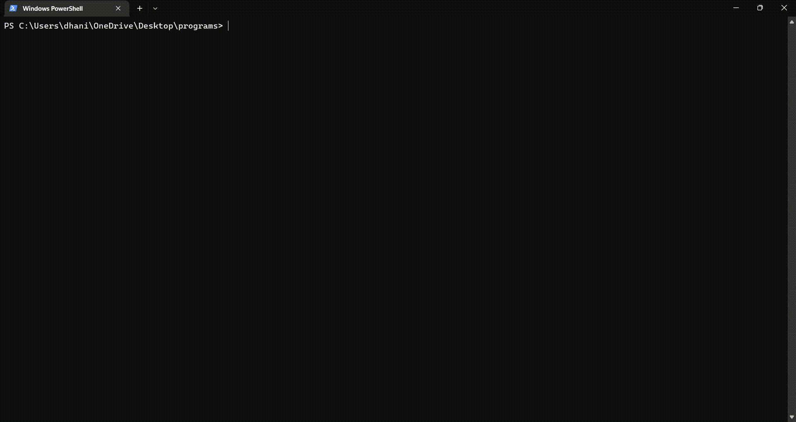

# Bank-Management-System
This is a simple model of a bank which can perform operations like account cretion, deposit,withdraw,check balance etc.
To use the code, download the code and run it on python compiler.
An example of how the program runs is given below : 

